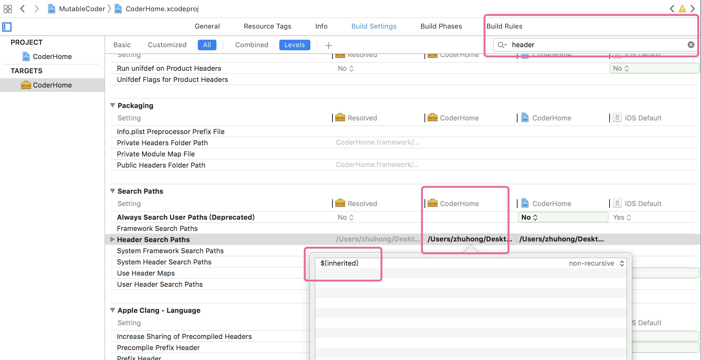

# MutableCoder
配置一个多工程的项目

简书介绍在[这里](https://www.jianshu.com/p/a5eff203b764)

## 以下更新于 2019-02-09

### 简单的架构图  


在 **MutableCoder** 这个项目中有两个模块 **首页** 与 **登录**。这两个模块没有直接被 MutableCoder 使用，而是通过 **平台-PlatformKit** 进入。进入之后两个模块 **首页** 与 **登录** 互相并不会有影响。在上图中没有体现的一点是：这两个模块能共用 **平台-PlatformKit** 中。

### 项目设置
#### 主项目
##### 图1
  
##### 图2
  

#### CoderLogin 与 CoderHome
以 **CoderHome** 为例  
##### 图1
  
##### 图2
 
##### 图3
 

### 核心代码实现
代码写得很随意、也很简单，但是万变不离其中。
#### 代码1
```
UINavigationController *mainNav = [MCPlatform sharedInstance].mainNav;
mainNav.view.frame = self.view.bounds;
mainNav.view.autoresizingMask = UIViewAutoresizingFlexibleHeight | UIViewAutoresizingFlexibleWidth;
[self addChildViewController:mainNav];
[self.view addSubview:mainNav.view];
```

#### 代码2
```
- (void)tableView:(UITableView *)tableView didSelectRowAtIndexPath:(NSIndexPath *)indexPath {
    [tableView deselectRowAtIndexPath:indexPath animated:YES];
    MainCell *cell = (MainCell *)[tableView cellForRowAtIndexPath:indexPath];
    // 通过 context 进入不同的子业务中
    [[MCPlatform sharedInstance] goWithContext:cell.mainModel.context];
}
```

#### 代码3
```
// 进入对应 context 的业务
- (void)goWithContext:(NSString *)context {
    id<MCPContextProtocol> mcContext = [[MCFactory sharedFactor] createWithName:context];
    [mcContext goWithNav:self.mainNav];
}
```


